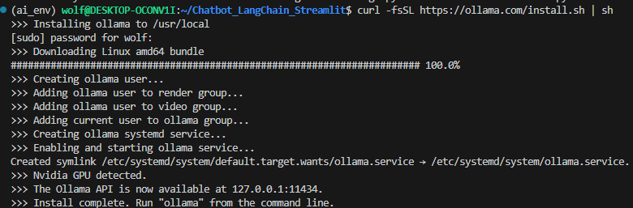
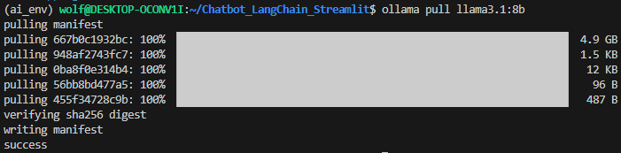

# Chatbot_LangChain_Streamlit
Repositório com o objetivo de estudar como realizar um chatbot com memória e interface utilizando LangChain e Streamlit.

## Preparação de ambiente (WSL2)

Primeiramente é necessário fazer o download do Ollama. É possível seguir as instruções pelo link abaixo:

[Ollama download para Linux](https://docs.ollama.com/linux)

Comando para download direto:

```bash
    curl -fsSL https://ollama.com/install.sh | sh
```

A ideia é que com isto, apareça o seguinte retorno após o download:



É possível verificar se a API do Ollama está rodando pelo link: `http://127.0.0.1:11434/`. Para verificar os modelos instalados na sua máquina acesse pela url `http://127.0.0.1:11434/api/tags`.

OBS. É possível rodar o streamlit dentro de uma WSL2 e acessar via navegador normalmente. Não há incompatibilidade nessa questão, pois o seu sistema operacional e o WSL2 compartilham da mesma rede. :)

Para iniciar o streamlit digite:

```bash
    streamlit run chatbot.py
```

Você pode acessá-lo no seu navegador normalmente pela url `http://localhost:8501`.

### Baixando o Llama3 para execução local com ollama no WSL2

Com o Ollama instalado no seu WSL2 basta digitar o seguinte comando para baixar o Llama3:

```bash
    ollama pull llama3.1:8b
```

É possível ver o seguinte resultado no final do download:



Para utilizar outros modelos basta procurar no site do Ollama pelo link [Ollama Models Library](https://ollama.com/library).